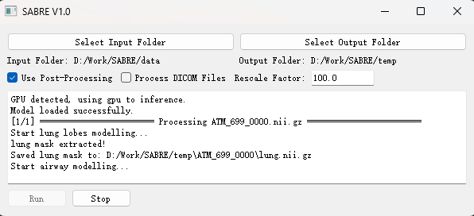

# 🫁 SABRE: Smart Airway Biomarker Recognition Engine

This is the official repository for the "**Prognostication in patients with idiopathic pulmonary fibrosis using quantitative airway analysis from HRCT**”. SABRE is the **first interpretable, fully automated** airway volume quantification tool tailored for idiopathic pulmonary fibrosis (IPF). It provides robust prognostic markers, improves early progression detection, and generalizes across fibrosing ILDs.  

If you find this work useful in your research, please cite:  

Nan Y, Federico F.N., Humphries S., *et al.* Prognostication in patients with idiopathic pulmonary fibrosis using quantitative airway analysis from HRCT: a retrospective study. **European Respiratory Journal.** 2025; 0: 2500981. DOI: [10.1183/13993003.00981-2025](https://doi.org/10.1183/13993003.00981-2025)  


---

## ⚡ Study Highlights

1️⃣ **Independent Prognostic Markers**  
SABRE-derived airway volume metrics showed significant, independent associations with mortality when adjusted for:  
- FVC%  
- DLCO%  
- Semi-quantitative radiology scores  
- Existing AI methods  

2️⃣ **Early Progression Detection**  
Incorporating SABRE metrics into predictive models rendered traditional lung-function markers non-significant,  
capturing **early 12-month progression** with superior sensitivity.  

3️⃣ **Risk Stratification**  
- High-risk group (top SPAV quartile) → **71.1% 12-month progression event capture**  
- ~9% improvement over the Composite Physiologic Index (CPI)  

4️⃣ **High Generalization Ability**  
Validated not only in **IPF cohorts**, but also in **other progressive fibrosing ILDs** (UILD, CTD-ILD, CHP).  

---

## 🚀 Key Contributions

1️⃣ **SABRE Tool** – The first airway-centric prognostic model tailored for IPF.  
2️⃣ **Robust Validation** – Demonstrated generalizability across **1,284 HRCTs** from two independent cohorts.  
3️⃣ **Prognostic Gain** – Combined with DLCO%, SABRE boosts:  
   - **1-year AUC = 0.852**  
   - **C-index = 0.752**  
4️⃣ **Open Science** – All model weights, preprocessing pipelines, and statistical analysis scripts will be publicly available.  

---

## 📋 User Guide
### 📁 Input Data Structure

SABRE supports two input formats for HRCT data:

#### Option 1: NIfTI Format
```
root_directory/
├── patient001.nii.gz
├── patient002.nii.gz
├── patient003.nii
└── patient004.nii.gz
```

#### Option 2: DICOM Format
```
root_directory/
├── case1_dir/
│   ├── CT_001.dcm
│   ├── CT_002.dcm
│   ├── CT_003.dcm
│   └── ...
├── case2_dir/
│   ├── scan_001.dcm
│   ├── scan_002.dcm
│   └── ...
└── case3_dir/
    ├── image_001.dcm
    ├── image_002.dcm
    └── ...
```
### 🚀 Usage
 

1. Install the requirements 
2. run app_packed.py 
3. Select data and output paths

